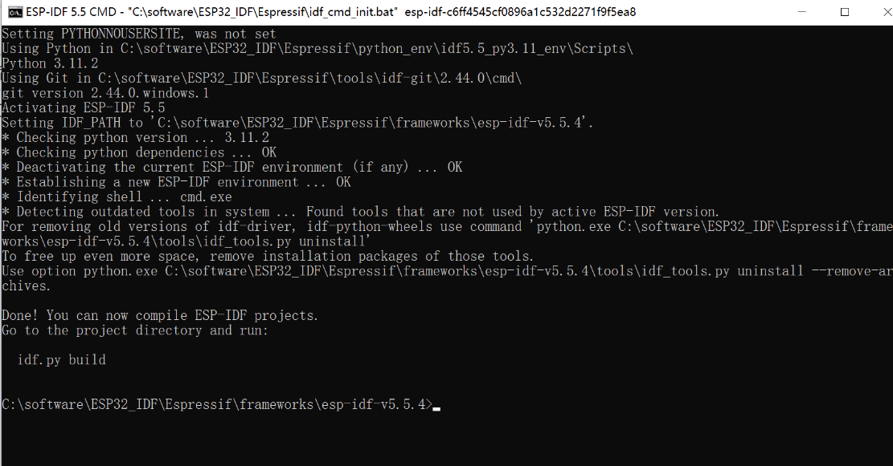
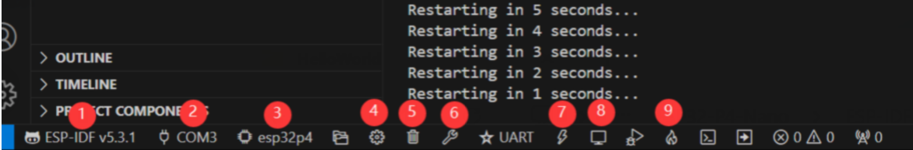

# ESP_P4_CAM_Server

一个基于 `ESP-IDF` 的 `ESP32-P4` 摄像头网页服务项目。
它运行在 `Waveshare ESP32-P4-WIFI6 Kit A` 上，使用板载摄像头进行实时预览、拍照、15 秒视频录制，并提供网页端参数调节能力。

## 1. 能做什么

当前版本已经支持这些功能：

- 连接 Wi-Fi，并在串口打印访问地址
- 浏览器访问板子 IP 后查看实时视频
- 在网页中调整分辨率、JPEG 质量、画面缩放、显示模式
- 使用 `GPIO46 / GPIO47 / GPIO48` 三个实体按键触发功能
- 本地 HTML 客户端输入 IP 后，可在电脑浏览器端自动保存照片和视频
- 支持 `/capture`、`/status`、`/control`、`/stream` 等兼容接口
- 支持 `mDNS` 访问，例如 `http://esp-web.local/`

## 2. 适用硬件

本项目当前是按下面这套硬件适配的：

- 主板：`Waveshare ESP32-P4-WIFI6`
- 版本：`Kit A`
- 主控：`ESP32-P4`
- 板载无线协处理器：`ESP32-C6`
- 摄像头：按官方示例工程使用的 `OV5647`
- 开发框架：`ESP-IDF v5.5.4`

项目中采用的是 `ESP32-P4 + ESP32-C6(SDIO)` 的官方推荐结构，而不是 Arduino 的 `esp_camera` 旧方案。

## 3. 这个项目和原始 CameraWebServer 的关系

1. 以 `ESP32-P4` 官方视频服务示例为底座
2. 迁移原有项目里真正有价值的业务逻辑
3. 按 `ESP-IDF` 的方式重新组织网页、按钮、相机控制和网络功能

## 4. 项目目录说明

建议先认识下面几个最重要的目录和文件：

- [main/simple_video_server_example.c](/c:/trwang/myProject/ESP32_P4_Cam/ESP_P4_CAM_Server/main/simple_video_server_example.c)
  这是主程序入口，包含相机初始化、HTTP 服务、WebSocket 事件、按键逻辑等核心代码。
- [main/Kconfig.projbuild](/c:/trwang/myProject/ESP32_P4_Cam/ESP_P4_CAM_Server/main/Kconfig.projbuild)
  这里可以配置按钮 GPIO、录像时长、JPEG 质量等项目参数。
- [frontend/](/c:/trwang/myProject/ESP32_P4_Cam/ESP_P4_CAM_Server/frontend)
  这是板子自带网页前端的源码，基于 `Vue + Vite`。
- [tools/CameraClientServer.html](/c:/trwang/myProject/ESP32_P4_Cam/ESP_P4_CAM_Server/tools/CameraClientServer.html)
  这是电脑本地打开的独立 HTML 客户端，用来输入 IP、接收按键事件，并自动保存照片和视频。
- [tools/pc_media_receiver.py](/c:/trwang/myProject/ESP32_P4_Cam/ESP_P4_CAM_Server/tools/pc_media_receiver.py)
  这是一个可选的电脑端接收程序，属于进阶方案，不是必须使用。
- [partitions.csv](/c:/trwang/myProject/ESP32_P4_Cam/ESP_P4_CAM_Server/partitions.csv)
  分区表文件。后续如果项目继续变大，这个文件很重要。
- [sdkconfig.defaults](/c:/trwang/myProject/ESP32_P4_Cam/ESP_P4_CAM_Server/sdkconfig.defaults)
  项目默认配置，包括 Wi-Fi、相机模式等。

## 5. 功能结构图

可以把系统理解成下面这样：

1. `ESP32-P4` 负责摄像头、HTTP 服务、网页接口、GPIO 按键。
2. `ESP32-C6` 负责 Wi-Fi 联网。
3. 浏览器有两种使用方式：
   - 直接打开板子的网页，进行预览和参数调节
   - 打开本地的 `CameraClientServer.html`，输入板子 IP，通过浏览器自动保存照片和视频

## 6. 按键定义

当前项目使用这 3 个 GPIO 作为按键输入：

- `GPIO46`：拍照
- `GPIO47`：启动/确保预览
- `GPIO48`：录制 15 秒视频

接线建议：

- 按键一端接对应 GPIO
- 按键另一端接 `GND`
- 软件内部使用上拉输入，按下时为低电平

也就是说，这是一个“低电平触发”的按键设计。

## 7. 软件环境准备

建议使用下面这套环境：

- Windows 10 / 11
- `ESP-IDF v5.5.4`
- Python 3.11
- 串口驱动正常
- 一根能传数据的 USB 线

如果你已经安装好了 `ESP-IDF`，通常只需要保证下面这些命令可用：

```bash
idf.py --version
python --version
```

## 8. 第一次上手：最短路径

如果你是第一次接触这个项目，推荐按下面步骤做。

### 第一步：连接开发板

把 `Waveshare ESP32-P4-WIFI6 Kit A` 用 USB 连到电脑。

### 第二步：确认 Wi-Fi 名称和密码

项目需要先连上热点，板子拿到 IP 后网页才能访问。

你可以用两种方法改 Wi-Fi：

#### 方法 A：直接在 menuconfig 里改

```bash
idf.py menuconfig
```

进入后找到项目的 Wi-Fi 配置项，填入你自己的热点名称和密码。

#### 方法 B：改默认配置文件

直接编辑：

- [sdkconfig.defaults](/c:/trwang/myProject/ESP32_P4_Cam/ESP_P4_CAM_Server/sdkconfig.defaults)

把里面的：

```text
CONFIG_EXAMPLE_WIFI_SSID="你的热点名"
CONFIG_EXAMPLE_WIFI_PASSWORD="你的密码"
```

改成你自己的信息。

### 第三步：编译项目

```bash
idf.py build
```

编译成功后，会生成：

- [build/ESP_P4_CAM_Server.bin](/c:/trwang/myProject/ESP32_P4_Cam/ESP_P4_CAM_Server/build/ESP_P4_CAM_Server.bin)

### 第四步：烧录到开发板

假设你的串口是 `COM10`：

```bash
idf.py -p COM10 flash monitor
```

### 第五步：看串口日志里的 IP

如果联网成功，你会看到类似下面的输出：

```text
Web UI: http://192.168.xxx.xxx/
Legacy capture: http://192.168.xxx.xxx/capture
MJPEG stream: http://192.168.xxx.xxx:81/stream
```

这说明板子已经准备好了。

## 9. 如何使用板子自带网页

在浏览器里打开串口日志打印出来的地址，例如：

```text
http://192.168.219.245/
```

打开后，你可以：

- 查看实时视频
- 切换分辨率
- 调整 JPEG 质量
- 设置画面缩放
- 在 `Fit / Fill` 之间切换显示模式

### 各个参数是什么意思

#### 分辨率

分辨率越大，画面越清晰，但也越吃带宽和性能。如果觉得视频卡，可以优先试这些较小分辨率：

- `800x640`
- `800x800`

#### JPEG 质量

质量越高，图像越清楚，但数据量越大。
如果视频卡顿，适当把质量调低会更流畅。

#### 缩放

这个只影响“浏览器怎么显示”，不改变摄像头真正输出的分辨率。

- `100%`：原始比例显示
- `200%`：放大两倍

#### Fit / Fill

- `Fit`：尽量完整显示整个画面，不裁切
- `Fill`：铺满容器，可能裁掉一部分边缘

如果你觉得画面“像被放大了”，通常把它切到 `Fit + 100%` 就比较正常。

## 10. 如何使用本地 HTML 自动保存照片和视频

这是本项目非常实用的功能之一。

### 第一步：打开本地 HTML

直接双击打开：

- [tools/CameraClientServer.html](/c:/trwang/myProject/ESP32_P4_Cam/ESP_P4_CAM_Server/tools/CameraClientServer.html)

### 第二步：输入板子 IP

例如：

```text
192.168.219.245
```

### 第三步：点击 `Connect`

连接成功后，页面会：

- 建立 `WebSocket` 事件通道
- 读取板子当前相机信息

### 第四步：开始使用

此时你可以：

- 点击 `Start Preview`
- 点击 `Capture Photo`
- 点击 `Record 15s Video`
- 调整分辨率、画质、缩放后点击 `Apply Camera Settings`

### 第五步：按实体按键

连接好 HTML 后，按板子上的按键也会触发浏览器动作：

- 按 `GPIO46` 对应按钮：浏览器自动保存一张照片
- 按 `GPIO47` 对应按钮：浏览器开始预览
- 按 `GPIO48` 对应按钮：浏览器录制 15 秒视频并自动下载

### 文件保存到哪里

浏览器下载的照片和视频默认保存在：

- 你的浏览器默认下载目录

一般是 Windows 的：

```text
下载
```

文件名类似：

```text
ESP32P4_Photo_时间戳.jpg
ESP32P4_Video_时间戳.webm
```

## 11. 一个完整实验流程

如果你是第一次做实验，推荐照下面做一遍：

1. 给开发板烧录固件
2. 打开串口，确认板子已经连上热点
3. 记下串口打印出来的 IP
4. 浏览器访问板子网页，确认能看到视频
5. 打开 [CameraClientServer.html](/c:/trwang/myProject/ESP32_P4_Cam/ESP_P4_CAM_Server/tools/CameraClientServer.html)
6. 输入 IP，点击 `Connect`
7. 点击 `Refresh Camera Info`
8. 调一个较流畅的分辨率，比如 `800x640`
9. 点击 `Apply Camera Settings`
10. 试一次 `Capture Photo`
11. 试一次 `Record 15s Video`
12. 再试按硬件按键，确认浏览器也能自动保存

做完这一轮，你就基本掌握整个项目了。

## 12. 编译和运行常用命令

### 编译

```bash
idf.py build
```

### 烧录

```bash
idf.py -p COM10 flash
```

### 烧录并打开串口

```bash
idf.py -p COM10 flash monitor
```

### 只打开串口

```bash
idf.py -p COM10 monitor
```

### 打开配置菜单

```bash
idf.py menuconfig
```

## 13. 常见问题

### 1. 串口里没有打印 IP

先检查下面几项：

- Wi-Fi 名称和密码是否正确
- 热点是不是 `2.4GHz`
- 板子是否已经成功识别板载 `ESP32-C6`

正常日志里应该看到：

```text
Identified slave [esp32c6]
Got IPv4 event
Web UI: http://...
```

### 2. 网页打开了，但是视频不流畅

可以这样处理：

- 分辨率调低一点
- JPEG 质量调低一点
- 用 `Fit` 模式而不是 `Fill`
- 缩放先设成 `100%`

### 3. 视频录制失败

本项目的视频录制是浏览器侧基于 `MediaRecorder` 做的，所以和浏览器本身能力有关。

建议：

- 优先使用最新版 `Chrome` 或 `Edge`
- 先确认预览已经正常显示
- 再点击录制
- 如果仍有问题，先把分辨率调低再试

### 4. 本地 HTML 连接失败

优先检查：

- IP 是否输入正确
- 开发板和电脑是否在同一个局域网
- 浏览器是否成功连到了 `ws://板子IP/ws`

### 5. 按键按了没有反应

先确认：

- 按键是否接对 GPIO46、47、48
- 按键另一端是否接了 `GND`
- 是否是低电平触发
- 浏览器里的本地 HTML 是否已经连接成功

## 14. 当前已知限制

这是目前版本你需要知道的几个现实情况：

- 当前 App 分区空间已经比较紧，后续再加大功能可能要调整分区表
- 浏览器保存文件默认走下载目录，不是任意自定义路径
- 视频录制依赖浏览器的 `MediaRecorder` 支持
- 本地 HTML 和板子网页是两套使用入口，定位不同

## 15. 适合从哪里开始改

如果是第一次做嵌入式网页项目，建议按这个顺序看代码：

1. 先看 [main/simple_video_server_example.c](/c:/trwang/myProject/ESP32_P4_Cam/ESP_P4_CAM_Server/main/simple_video_server_example.c)
   先理解“上电后做了什么”
2. 再看 [main/Kconfig.projbuild](/c:/trwang/myProject/ESP32_P4_Cam/ESP_P4_CAM_Server/main/Kconfig.projbuild)
   理解哪些参数是可配置的
3. 再看 [tools/CameraClientServer.html](/c:/trwang/myProject/ESP32_P4_Cam/ESP_P4_CAM_Server/tools/CameraClientServer.html)
   这个文件最容易读懂，也最适合新手理解“浏览器怎么跟板子交互”
4. 最后再看 [frontend/](/c:/trwang/myProject/ESP32_P4_Cam/ESP_P4_CAM_Server/frontend)
   这是项目自带网页的正式前端，结构更完整

## 16.下载ESPidf注意事项


下载教程主要参考正电原子的教程，建议一次性部署完成，否则可能存在删除不干净或者下载不完全等问题。

[ESP-IDF 开发 | 微雪文档平台](https://docs.waveshare.net/ESP32-P4-WIFI6/Development-Environment-Setup-IDF)

* 教程路径：[第5.1讲 搭建VSCode开发环境_哔哩哔哩_bilibili
  ](https://www.bilibili.com/video/BV1EPisBWEUX?spm_id_from=333.788.videopod.episodes&vd_source=16653787726583a107f817924f9f09fe&p=6)

  需要注意先下载官方离线idf，

  

  然后再下载vscode插件，如果插件没有反应，检查python,conda等和python环境有关的配置，进入到下图界面即成功配置espidf以及vscode插件。

  
*  * **①ESP-IDF 开发环境版本管理器** ：当我们的工程需要区分开发环境版本时，可以通过安装不同版本的 ESP-IDF 来分别管理，当工程使用特定版本时，可以通过使用它来切换
  * **② 设备烧录 COM 口** ，选择以将编译好的程序烧录进芯片上
  * **③set-target 芯片型号选择** ：选择对应的芯片型号，如：ESP32-P4-WIFI6 需要选择 esp32p4 为目标芯片
  * **④menuconfig** ：点击修改 sdkconfig 配置文件内容
  * **⑤fullclean 清理按钮** ：当工程编译报错或其他操作污染编译内容时，通过点击清理全部编译内容
  * **⑥Build 构建工程** ：当一个工程满足构建时，通过此按钮进行编译
  * **⑦flash 烧录按钮** ：当一个工程 Build 构建通过时，选择对应开发板 COM 口，点击此按钮可以将编译好的固件烧录至芯片
  * **⑧monitor 开启烧录口监控** ：当一个工程 Build—>Flash 后，可通过点击此按钮查看烧录、调试口输出的 log，以便观察应用程序是否正常工作
  * **⑨Build Flash Monitor 一键按钮** ：用于连续执行 Build—>Flash—>Monitor，常被称作小火苗

## 17.注意

建议第一次先不要急着改代码，先把它完整跑通一遍。
只要能成功做到这几件事：

- 串口看到 IP
- 浏览器看到视频
- 调整分辨率成功
- 拍照成功下载
- 15 秒视频保存成功
- 按按键也能触发动作
