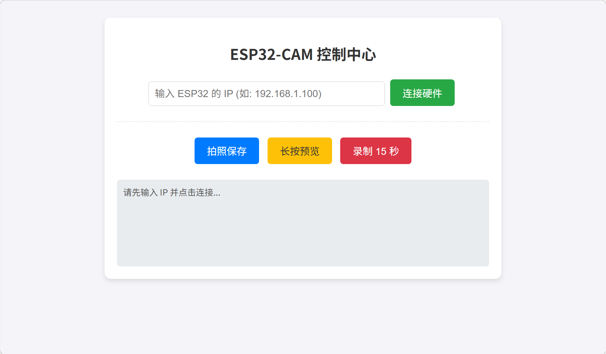
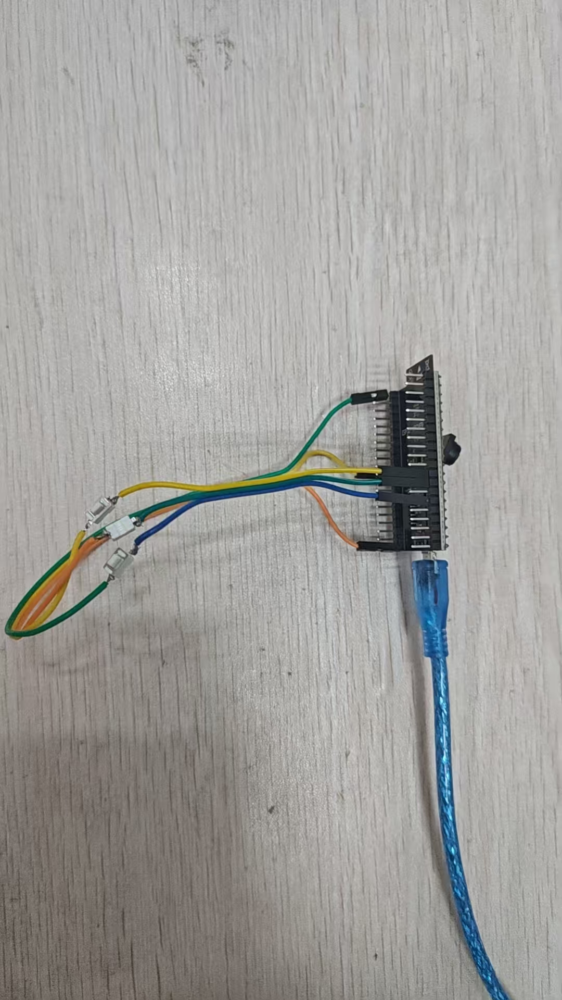
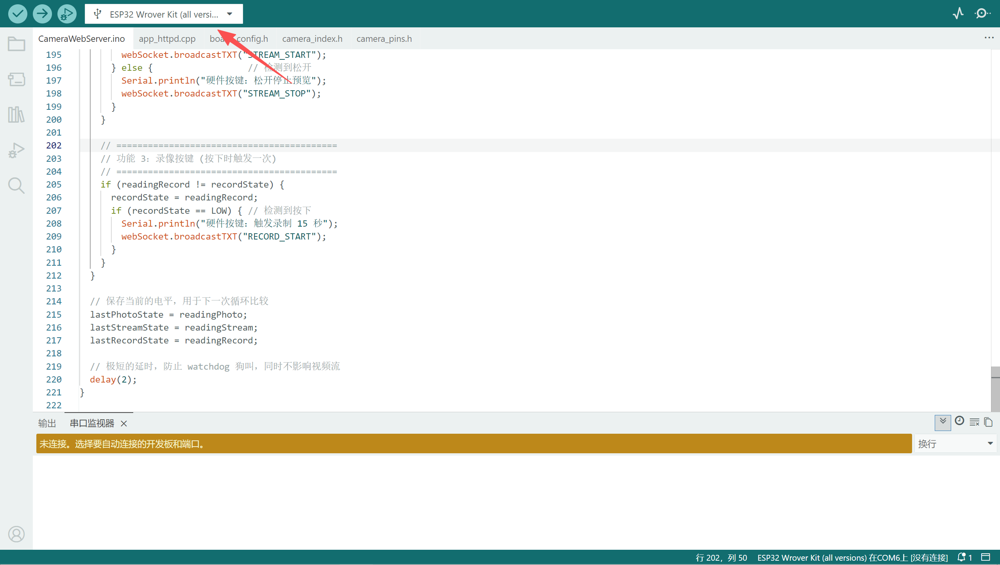
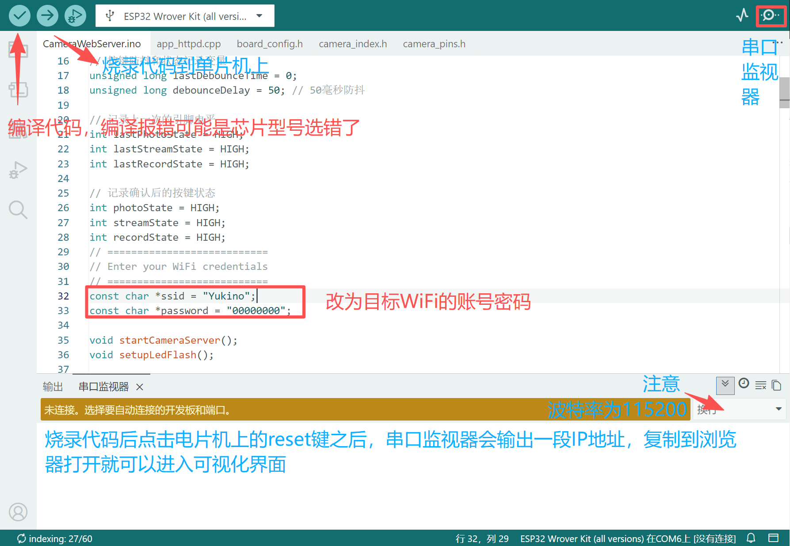
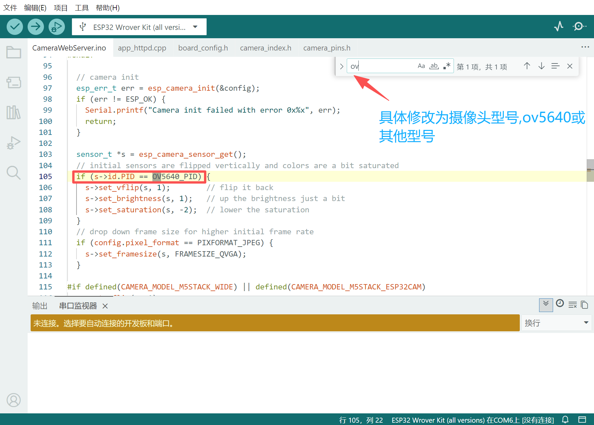

# ESP32_Cam_server

斜眼检测手持无线设备

# 项目运行效果

将代码烧录到单片机后，reset之后可以在串口监视器终端看见一行ip地址，使用链接在同一网络下的设备打开CameraClinetServer\ClinetServer.html如下图：

将串口监视器输出的IP输入可视化界面中点击连接硬件，即可进行照片拍摄，实时预览效果，15s视频录制(可以通过可视化界面操作也可以通过硬件按钮操作)，保存到本地电脑或者平板上。

# 如何安装开发环境

在开发环境安装教程目录下打开注意事项，下面的网址有详细的Arduino IDE安装教程。https://blog.csdn.net/qq_34426854/article/details/145853077?spm=1001.2014.3001.5502

# 如何下载烧录代码

！！注意：USB链接开发板与电脑之后，选择对应的com口，如何选择CAMERA_MODEL_WROVER_KIT如下图所示(非常重要)！！

主要修改目标WiFi的账号密码，操作如下图：

# 常见问题

1.烧录代码时需要同时按住板子上的boot和reset按键之后才能成功下载。

2.需要注意3个按键的IO硬件链接为12,13,14。

3.为什么视频很卡？

答：可以直接将输出的IP复制到浏览器，将第一行的数值20改为15然后set保存。注意切换正确型号的摄像头，操作如下图：

4.怎么对摄像头拍摄效果进行参数调整？

答：先将输出的IP地址复制到浏览器中，调整各个选项到合适的效果，记录下来，然后在CameraWebServer\CameraWebServer.ino的setup()函数中调整。
